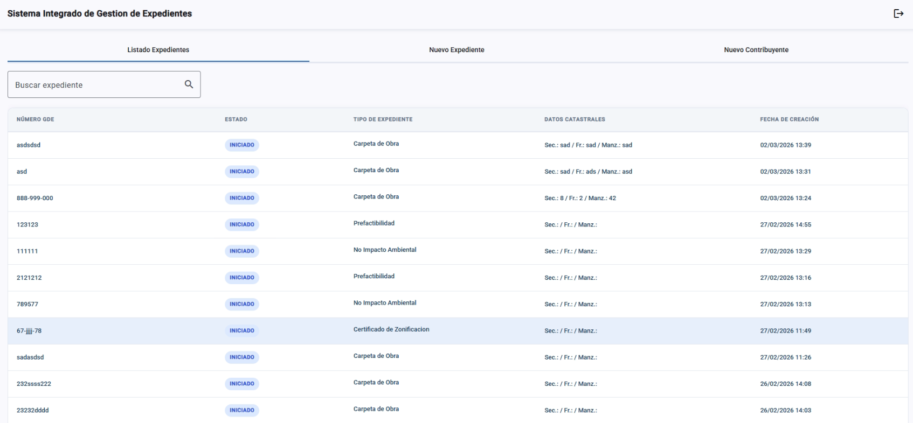
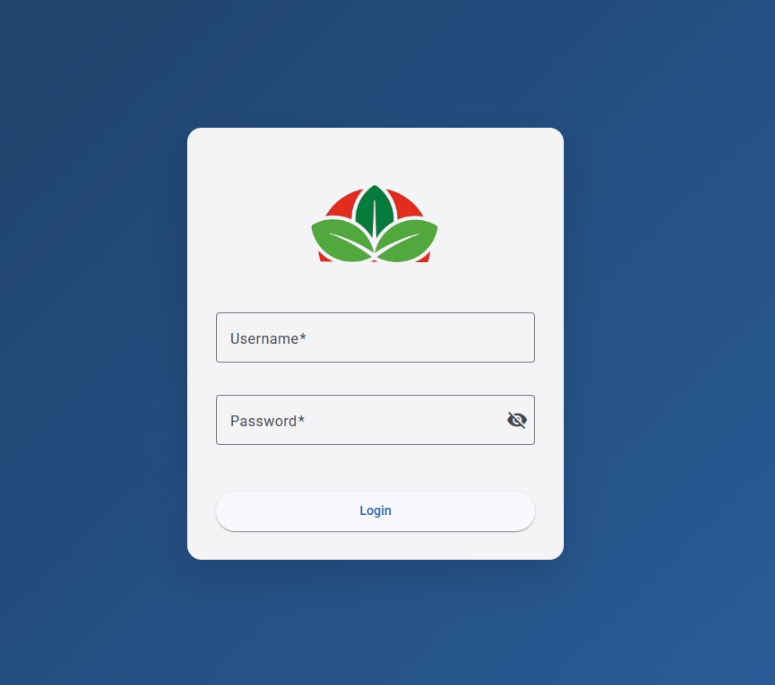

<h1>Hola, soy Mati 👋</h1>

---

## Sobre mi
- 💻 Desarrollador Full Stack
- 🛠️ Anteriormente Soporte Tecnico
- ⚽ Apasionado por el código y el fútbol

 

# Proyectos

<table>
<tr>
<td width="100%">

<h3 align="center">Sistema de Gestión de Expedientes</h3>

<table>
<tr>
<td align="center">

</td>

<td align="center">

</td>
</tr>
</table>

 

Sistema de Gestión de Expedientes para facilitar la aprobación de documentos por parte de los usuarios municipales y mejorar la experiencia de los contribuyentes.

</td>
</tr>
</table>
